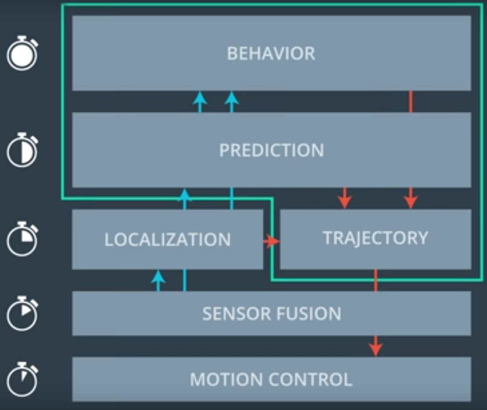

#  Highway Driving
 The goal of this project is to build a path planner that creates smooth, safe trajectories for the car to follow. The highway track has other vehicles, all going different speeds, but approximately obeying the 50 MPH speed limit. 
 
 
# 1. Project instructions:
* The car transmits **its location, along with its sensor fusion data, which estimates the location of all the vehicles on the same side of the road**.

* The path planner outputs a list of x and y global map coordinates. Each pair of x and y coordinates is a point, and all of the points to gether form a trajectory. You can use any number of points that you want, but the x list should be the same length as the y list. The car moves from point to point every 20 ms perfectly and the car's new rotation becomes the line between the previous waypoint and the car's new location.

* The velocity of the car depends on the spacing of the points. Because the car moves to a new waypoint every 20ms, the larger the spacing between points, the faster the car will travel. The speed goal is to have the car traveling at (but not above) the 50 MPH speed limit as often as possible but there will be times when traffic gets in the way.

* Acceleration is calculated by comparing the rate of change of average speed over 0.2 second intervals. In this case above total acceleration at one point was as high as 75 m/s^2.
 
* The jerk is calculated as the average acceleration over 1 second intervals. In order for the passenger to have an enjoyable ride both the jerk and the total acceleration should not exceed 10 m/s^2.

* Part of the total acceleration is the normal component, AccN which measures the centripetal acceleration from turning. The tighter and faster a turn is made, the higher the AccN value will be. 

* Highway Map Inside [data/highway_map.csv]() there is a list of waypoints that go all the way around the track. The track contains a total of 181 waypoints, with the last waypoint mapping back around to the first. The waypoints are in the middle of the double-yellow dividing line in the center of the highway.

   The track is 6945.554 meters around (about 4.32 miles). If the car averages near 50 MPH, then it should take a little more than 5 minutes for it to go all the way around the highway. 
The highway has 6 lanes total - 3 heading in each direction. Each lane is 4 m wide and the car should only ever be in one of the 3 lanes on the right-hand side. The car should always be inside a lane unless doing a lane change.

* The sensor_fusion variable contains all the information about the cars on the right-hand side of the road. The data format for each car is: [ id, x, y, vx, vy, s, d]. The id is a unique identifier for that car. The x, y values are in global map coordinates, and the vx, vy values are the velocity components, also in reference to the global map. Finally s and d are the Frenet coordinates for that car. The vx, vy values can be useful for predicting where the cars will be in the future. For instance, if you were to assume that the tracked car kept moving along the road, then its future predicted Frenet s value will be its current s value plus its (transformed) total velocity (m/s) multiplied by the time elapsed into the future (s).

The architecture can be schematically represented as follows.

## 2.	Code Overview
If you think about the over all flow of data in a self-driving car operating on the fastest time scales you have: 

1.	First [Motion](https://github.com/A2Amir/Motion-Model-of-a-Car) Control
2.	Than  you have [Sensor Fusion](https://github.com/A2Amir/Extended-Kalman-Filter-for-Sensor-Fusion-Radar-and-Lidar).
3.	Just lower than you have [localization](https://github.com/A2Amir/Implement-a-particle-filter-in-the-context-of-Cplus) and trajectory planning.
4.	Next is [Prediction](https://github.com/A2Amir/Prediction-Phase-in-the-trajectory-generation-of-cars) which you just learned about.
5.	And then at the top is behavior planning with the lowest update rate.

  
 

